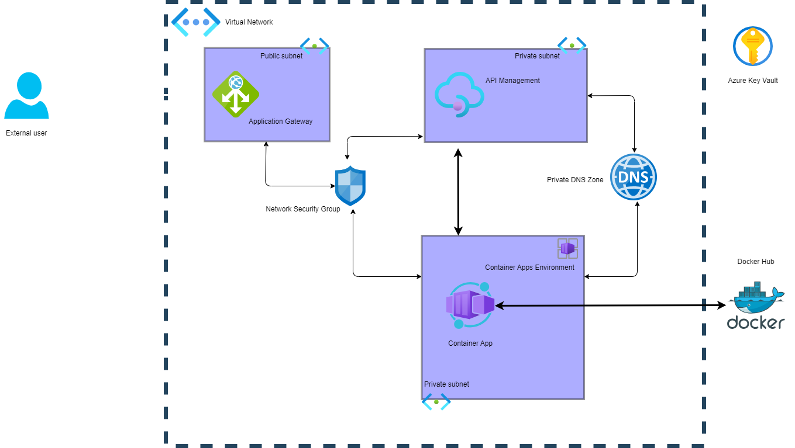
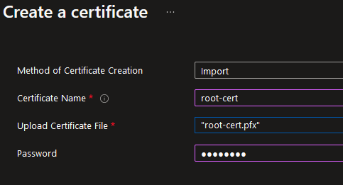
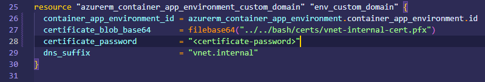

# Azure Container Apps with Internal API Management and Application Gateway

## Scenario

This recipe addresses a scenario where there is a requirement to restrict HTTP/S access to an Azure Container App to a specific virtual network, while providing advanced security and networking functionality like network security groups, ssl offloading, etc. In this scenario, clients will be capable of accessing the resources by pointing to App Gateway without any problem and by not letting them access any other resources from the system.

The Container App is configured with an internal [custom domain](https://learn.microsoft.com/azure/dns/private-dns-privatednszone) and can be accesed from API Management this way, APIM is then ready to be accessed trough App Gateway using the same custom domain.

> The core of all of this is the Private DNS Zone this functionality and a good configuration with Network Security Groups are the perfect mix to make it, in this sample we'll be using a domain like *.vnet.internal

API Management and Application Gateway services allow for a custom security profile for the Azure Container App when used in tandem. An API Management instance in internal mode is placed in front of the Azure Container App and controls all traffic that is routed to the API from within the network. API callers from within the virtual network are able to access the Container App via the API Management endpoints. An Application Gateway handles ingress into the network and routes requests from outside of the virtual network to the API Management instance.

### Problem Summary

There are multiple challenges to configuring an Container App to be accessible only via a private virtual network or from a set of trusted partners:

- Configuration of the Container App Environment ingress only inside of a VNET.
- Linking the Container App to API Management using the correct policies.
- Deploying application automatically without a problem.
- Creation and management of certificates for custom domains.
- Configuration of the connection between Application Gateway and API Management.

This recipe attempts to make such configuration easier by providing both Terraform and Bicep assets to serve as a starting point to understand how to configure the whole system with additional layers of security and functionality provided by API Management and Application Gateway.

### Architecture



### Recommendations

The following sections provide recommendations on when this recipe should, and should not, be used.

#### Recommended

This recipe is recommended if the following conditions are true:

- The Azure Container App can be reached inside of the virtual network for developing purposes.
- Private (virtual network) connectivity to the Azure Key Vault used for persisting application secrets.
- Ability to use Azure Private DNS Zones.
- Ability to use a Network Security Group.
- Requirement to apply custom API Management policies like rate limiting, caching, etc.
- Customizable Application Gateway rules to make the services accesible from public networks.

#### Not Recommended

This recipe is **not** recommended if the following conditions are true:

- Azure Container App HTTP/S endpoint is accessible from the public Internet.

## Getting Started

The following sections provide details on pre-requisites to use the recipe, along with deployment instructions.

### Pre-requisites

The following pre-requisites should be in place in order to successfully use this recipe:

- [Azure CLI](https://docs.microsoft.com/cli/azure/install-azure-cli)
- An active Azure Subscription.
- Terraform installed (if you want to deploy with Terraform).

### Deployment

To deploy this recipe, perform the infrastructure deployment steps using _either_ Terraform or Bicep in the expected order to make everything go great.

### Remote Access

The recipe does not provision a Virutal Machine (VM) or Azure Bastion to provide remote access within the virtual network. Nevertheless, there is an extra subnet already being created for the VM, the subnet name is **apps-subnet**, however if you want to create a bastion instance you'll need to create it and let bastion create the needed subnet.

### Virtual Network

The recipe provides a virtual network with 5 different subnets. The recipe creates an Azure Private DNS zone to work with all required features in a simple topology letting them working in coordinationwithout a problem, in order to create the DNS Zone with certificates you'll need to create them and then add them to the Private Zone.

### Create Certificates for API Management Custom Domains

API Management is able to expose endpoints using a custom domain rather than the default `azure-api.net` subdomain that is assigned to the service. In this recipe, custom domains are used in order to allow the user to expose an API using the same domain name both _inside_ and _outside_ the virtual network. Inside the virtual network, the custom domains map directly to the API Management private IP address. The domains are mapped to the Application Gateway public IP address for calls originating from outside the virtual network. The recipe assumes that the user possesses the server certificates for the Gateway, Portal, and Management endpoints on for the API Management instance, and the root certificate used to sign those requests. The [create-certificates.sh](./deploy/bash/create-certificates.sh) script provides openssl commands to create and self-sign the required certificates.

It is important to prefix your domain with *, so the same generated domain cert may be used for all the different sub domains.
The script creates a `.certs` folder that contains each of the `.pfx` certificates for the API Management custom domains and the `.crt` file for the root.

## Deploying the solution

If you want to deploy the whole solution using Bicep go to this section.

If you want to deploy the whole solution using Terraform go to this section.

## Deploy the solution using Bicep

Before getting started, you can go to the file [bicep-deploy.sh](./deploy/bash/bicep-deploy.sh), this file can make the whole process for you without a problem. The following guide is just a description of the steps in that script. If you want to run this script, you just need to run:

```bash
bash bicep-deploy.sh
```

### Step 1: Creating the certificates

The first step is to create the certificate files that you'll load into Key Vault, to do that just go to the **bash** folder and execute the script.

```bash
./create-certificate.sh
```

**IMPORTANT**: When prompted, for the first certificate the common name (FQDN) must be **internal** and for the second prompt the common name must be ***.vnet.internal**. The result must be a new folder called **certs** and include six different files.


### Step 2: Deploy the pre-requisites using Bicep

You can go to the folder **pre** and then run the following command for Bicep.

```bash
#Create a resource group
az group create --name internalContainerApps --location eastus2

# Deploy the resources using Bicep
az deployment group create --resource-group internalContainerApps --template-file main.bicep

```

After deployment, go to the portal and upload the **pfx** files.



You need to repeat it with the second pfx file.


### Step 3: Deploy the main infrastructure using Bicep

Move to the folder **infrastructure** and run one single command.

```bash
# Deploy the infrastructure using Bicep
az deployment group create --resource-group internalContainerApps --template-file main.bicep
```

That's it! The easiest step of the process right?

### Step 4: Publish the Docker images to ACR

With the infrastructure already deployed you can build and publish the image for the application, in this case a simple Web API. You can see the project called [WeatherForecastAPI](../common/app_code/WeatherForecastAPI/) in this repo.

In order to publish the project you need to login to ACR, build the image and then publish it.

```bash
ACR_NAME="<name of the ACR instance>"

az acr login --name $ACR_NAME
docker build -t $ACR_NAME.azurecr.io/testing-app:latest ../../../common/app_code/WeatherForecastAPI
docker push $ACR_NAME.azurecr.io/testing-app:latest
```

You can confirm this step going to the portal and verifying that the image is already in the Container Registry.


### Step 5: Deploy the Container App

Go to **app** folder and run one single command.

```bash
# Deploy the application using Bicep
az deployment group create --resource-group internalContainerApps --template-file main.bicep
```

After this step is time to test the solution.

### Step 6: Test the public endpoint

In order to test the solution you need to know the IP address of the Application gateway. There are two ways to do this fast, the first one is executing the following list of commands.

```bash
PUBLIC_IP_ID=$(az network application-gateway show --resource-group internalContainerApps --name test-appGw --query "frontendIPConfigurations[0].publicIPAddress.id" --output tsv)

PUBLIC_IP=$(az network public-ip show --ids $PUBLIC_IP_ID --query "ipAddress" --output tsv)

echo $PUBLIC_IP
```

Or you can easily go to the Azure portal and go to the Application Gateway


Once you get the public IP address, you can start building the URL for the Web API. The structure is the following.

```bash
http://<app gateway public ip>/<container app name>/<web api method>
```

The result must present the response for both methods.

Hello world method.


Weather Forecast method.


**Note**: Because you are using Api Management you will be capable of accessing the methods but won't be able to access a Swagger interface even if it is enabled (just like the sample application).

## Deploy the solution using Terraform

### Step 1: Creating the certificates for the solution

The first step is to create the certificate files that you'll load into Key Vault, to do that just go to the **bash** folder and execute the script.

```bash
./create-certificate.sh
```

**IMPORTANT**: When prompted, for the first certificate the common name (FQDN) must be **internal** and for the second prompt the common name must be ***.vnet.internal**. The result must be a new folder called **certs** and include six different files.


### Step 2: Deploy the pre-requisites for Terraform

You can go to the folder **pre** and then go to the key vault certificate blocks to update the passwords for the **pfx** files.


After modified you can deploy all your infrastructure.

```bash
# Initialize terraform
terraform init

# Execute plan
terraform plan -out plan.out

# Apply the plan
terraform apply "plan.out"
```

### Step 3: Deploy the main infrastructure using Terraform

Go to the **infrastructure** folder and you can to observe that the blocks for **azurerm_key_vault_access_policy** and **azurerm_api_management** have some commented lines.

You'll need to deploy the whole infrastructure keeping this comments.

```bash
# Initialize terraform
terraform init

# Execute plan
terraform plan -out plan.out

# Apply the plan
terraform apply "plan.out"
```

After the deployment uncomment first the access policy block, you just need to run plan and apply commands.


After a succesful execution you can uncomment API management instance lines and run the script again.


### Step 4: Publish the Docker images to Azure Container Registry

With the infrastructure already deployed you can build and publish the image for the application, in this case a simple Web API. You can see the project called [WeatherForecastAPI](../common/app_code/WeatherForecastAPI/) in this repo.

In order to publish the project you need to login to ACR, build the image and then publish it.

```bash
ACR_NAME="<name of the ACR instance>"

az acr login --name $ACR_NAME
docker build -t $ACR_NAME.azurecr.io/testing-app:latest ../../../common/app_code/WeatherForecastAPI
docker push $ACR_NAME.azurecr.io/testing-app:latest
```

You can confirm this step going to the portal and verifying that the image is already in the Container Registry.


### Step 5: Deploy the Container App

Move to the **app** folder and open the **main.tf** file. You need to add the password for the block **azurerm_container_app_environment_custom_domain**



After that update you can deploy the infrastructure.

```bash
# Initialize terraform
terraform init

# Execute plan
terraform plan -out plan.out

# Apply the plan
terraform apply "plan.out"
```

### Step 6: Test the public endpoint
